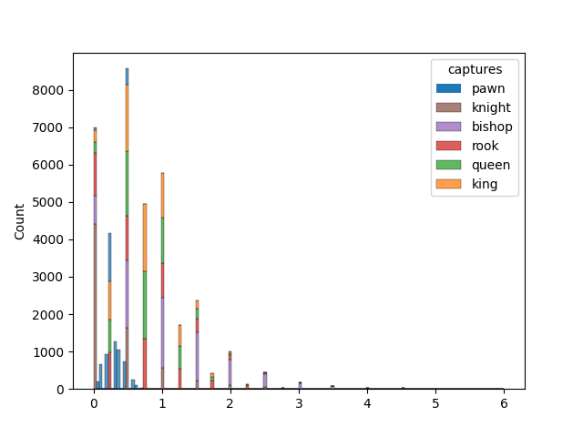

# ChessWrangle

Wrangling through unstructured and "badly" formatted data is an essential part of the work of data professionals. However, finding publicly available data that is as messy as it will get can be surprisingly rare to come by. 
As I was searching for some data to play around with, I came across [this](https://chess-research-project.readthedocs.io/en/latest/#) dataset of 3.5 million chess games. While it does contain some nicely structured metadata, such as the date of the game, the players' ELO ratings etc., it also contains a very interesting type of unstructured data, namely the lists of the individual games' moves. 

There are two more things that make this dataset especially interesting for aspiring data wranglers:
1. The dataset does not seem to rigidly follow the standard Portabkle Game Notation (PGN) format. Hence, there is some prep work to do to parse it.
2. There are a number of games that are not documented correctly, so we need to check for that and omit them from further analysis.

The moves of chess games can be documented in a number of ways, but the SAN (Standard Algebraic Notation) is the most common one, and that's also what we find here.

As you would expect, there is a handy [chess](https://python-chess.readthedocs.io/en/stable/core.html) library for python that helps a lot with working with a digital chess board. 

## What is useful?
To transfer this unstructured (i.e. "useless") data into structured ("useful") data, we first need to think about what our use case should be. I decided to do something a bit unconventional: tracking the usage statistics of the different piece types (although I am sure someone has done something similar before me).

So what do I mean by "usage statistics"? Well, different figures types have different moves available to them, plus they start out on different fields. So it makes sense that they are also used in quite different ways.
This could include how many fields they travel on average, how many captures they take and how long they remain, on average, in the game.

With such a large dataset, we should be able to collect these, and other statistics, quite extensively. I took it as a nice opportunity to challenge myself and my data wrangling skills.

## Play the game
To make it easier for ourselves (and to be able to upload a dataset to GitHub), I used the first 10k games of the dataset.

In this little project, the usage statistics are calculated for the *average* figure per game of each type. You could see them as the expected value, e.g. if I pick any figure of a given type, how long will it stay in the game compared to a figure of a different type.
Once we know this, we can plot the distribution of the usage stats per piece type and can, for example, find out how many games were played where the average bishop had 3 captures. I intentionally recorded the usage statistics for an average piece per game. This way, the pawns don't get an unfair advantage, even if they outnumber the queens by 8 to 1.

## Follow-up
As soon as I get back to this project, I will first add logging functionality, replacing the print statements. Also, the performance can likely be improved.

I would also like to expand it by additionally calculating summary scores per piece type, for example, to describe how aggressively or defensively a certain piece type is played.
Another fun thing to do would be to correlate the overall aggressiveness to the players' ELO rating (do weak players play more aggressively against strong players?).

If you have other ideas or if you have feedback on the existing code, let me know!
